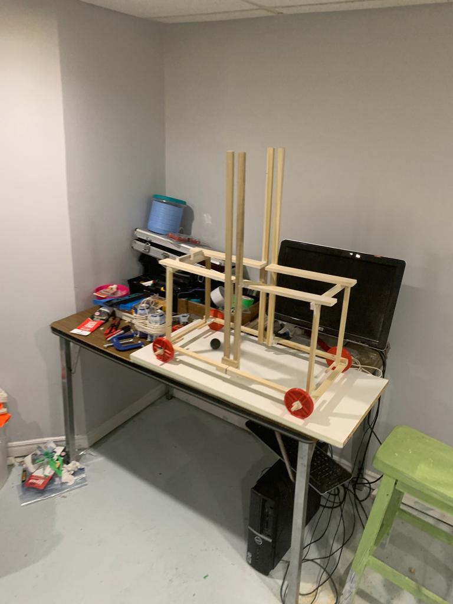

# Trebuchet Project

## Overview

This repository houses the documentation and LaTeX reports for a Trebuchet Project. Explore detailed reports and analyses of the project's design, construction, and performance.

## Table of Contents

- [Reports](#reports)
- [Trebuchet Design](#trebuchet-design)
- [Usage](#usage)
- [License](#license)

## Reports

1. [Progress Report](reports/Progress_Report.pdf)
2. [Final Report](reports/Final_Report.pdf)

## Trebuchet Design

The Trebuchet Project involves the design, construction, and analysis of a trebuchet, a medieval siege engine. The reports provide in-depth insights into the project's various aspects.

## Usage

1. **Access Reports:** Visit the [Reports](#reports) section to download and explore detailed reports in PDF format.
2. **LaTeX Source:** Access the LaTeX source files for reports within the `reports/` directory.
3. **Build Reports:** Use a LaTeX editor or compiler to build reports from the LaTeX source files.

## License

This project is licensed under the terms of the [GNU General Public License (GPL) version 3.0](LICENSE).

You can find a copy of the license in the [LICENSE](LICENSE) file included with this distribution.
This project is licensed under the [MIT License](LICENSE).

